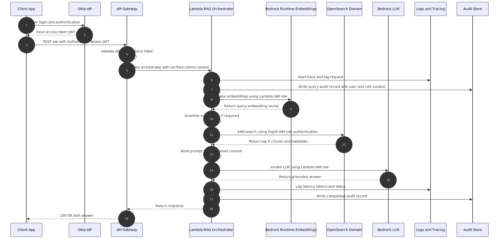

# Summary

## Business Driver

In Stock Plan Services, we support a large volume of questions that depend on *plan documents, policies, and operational knowledge*. While the information is accurate, it is fragmented and hard to search, which makes it time-consuming to interpret — especially as volume increases. Over time, **efficiency and consistency have become real challenges**.

A generic chatbot or an LLM answering from its own knowledge will not work. **Accuracy and explainability are non-negotiable** in the **regulated** environment. Using RAG allows us to generate answers that are grounded strictly in approved content, which is critical from a **regulatory and compliance** standpoint.
***

## Scope

- External participant and Internal users asking plan and policy related questions
- Need for consistent, explainable answers grounded in approved content
- No autonomous decision-making or customer-facing advice
***

# Conceptual View

## Use case view


***
## Architecture Overview

Key components:
- RAG Orchestrator
- Ingestion Orchestrator
- Embedding
- Vector Search
- LLM Inference
- Monitoring & Governance Layer
  
### Target State


***
### Sequence Diagrams

#### Ingestion flow


#### Retrieval flow


#### Auth/z flow


***
# Critical Decisions

## Significant Architecture Decisions


| Area | Decision | Rationale | Impact |
| ---- | -------- | --------- | ------ |
|  Bedrock knowledge base    | Despite its advantages, we evaluated and ultimately opted against AWS Knowledge Base for our production scenario.<br><br>|   The primary factor was **cost-efficiency.** AWS Knowledge Base relies heavily on OpenSearch instances, which rapidly become expensive at scale.|Our existing custom implementation achieves similar functionality more economically by:- Manually chunking documents using customizable splitters.- Storing embeddings directly into optimized OpenSearch indices.- Executing targeted semantic searches without incurring additional managed service costs.
| Bedrock Data Automation | We decided not to use BDA |  Data content is text ( no images or videos), and we need to control extraction (chunking) | Define the chunking and the overlays
| Vector Type | Use Vector type of `byte` | `float` vectors are expensive (memory and latency)| Titan embedding only supports Float32 so we had to do quantization to int8.<br><br>~3x less memory, ~1% recall loss
| Chunking Strategy | Fixed length with Overlay|
| Threshold | 0.8 | Certain amount of accuracy needed | Answers with lower threshold will be asked to call|
| Guardrails | Use GuardRails and custom regex for PII protection and advice constraints | Custom regex rules combined with AWS Guardrails works for this solution|

***
## Significant Assumptions Made

| Area | Assumption |
| ---- | -------- |
|  Use case   |  The source content is to be allowed for LLM inference(policy/compliance approval for Bedrock usage)  |
| Data and Document  | Documents arrive in **S3** and are the primary source of truth  |
|  Retrieval  | Business is ok with **eventual consistency**: new docs may take seconds/minutes to appear in retrieval|
***
## Alternatives Considered

### 1. Keyword Search + Manual Interpretation
Pros: Simple, low risk
Cons: Slow, inconsistent, not scalable

### 2. Fine-tuned LLM without Retrieval
Pros: Fluent responses
Cons: Hallucination risk, no explainability
***
# Non Functional Requirement
## NFRs
- if the retrieval confidence / threshold is low ask the customer to call
- Re-runs of ingestion/indexing should not corrupt the index; support rollback to previous index version
- The solution should plan for continuous validation, monitoring and governance ( Auditability and Regulations)
***
# Security & IAM View


***

# Deployment View

The system is deployed in a **multi-AZ, multi-region architecture**. The primary region us-west1 operates **active/active across availability zones**, while a secondary region us-east1 is provisioned as a **hot standby** with no live traffic. **DNS-based failover** is used to promote the standby region during regional outages.

1. **Active/active within a region** is achieved by deploying Lambdas across **private subnets in 2 AZs** and using **managed multi-AZ services** (API GW, S3, OpenSearch).
2. **OpenSearch indices (including vector indices) are replicated cross-region** from the active domain to the standby domain, while **S3 uses cross-region replication** for source documents. **DNS failover** is used to shift traffic to the standby region during a regional outage.
3. **Active-hot across regions** is achieved via **Route53 failover routing**; Region B is fully provisioned but **takes traffic only during failover**.


# Data View
## Data Models
### OpenSearch Record
|doc_id|chunk_id|source|page|text (preview)|vec (preview)|
|---|--:|---|--:|---|---|
|planDoc-2026-001|12|2026_Plan_Document.pdf|34|Vesting occurs on the anniversary…|[12, -7, 127, 4, …]|
|planDoc-2026-001|13|2026_Plan_Document.pdf|35|If employment terminates for cause…|[-3, 44, 9, -128, …]|
|policy-Ticker-014|5|Policy.docx|2|Tax withholding is calculated based on…|[66, -12, 0, 8, …]|

### Search response

```
{
  "hits": {
    "hits": [
      {
        "_id": "planDoc-2026-001",
        "_score": 0.78,
        "_source": {
          "doc_id": "planDoc-2026-001",
          "chunk_id": 12,
          "source": "2026_Plan_Document.pdf",
          "page": 34,
          "text": "Vesting occurs on the anniversary date unless accelerated..."
        }
      }
    ]
  }
}
```

### kNN Query
```{
  "size": 3,
  "query": {
    "knn": {
      "vec": {
        "vector": [10, -9, 127, 3, ...],
        "k": 3
      }
    }
  },
  "_source": ["doc_id", "chunk_id", "source", "page", "text"]
}
```
# Controls & Monitoring


### Preventive Controls
- Approved document ingestion only
- Retrieval confidence thresholds
- Prompt-level grounding and refusal rules

### Detective Controls
- Retrieval hit rate monitoring
- No-answer / escalation rate
- User feedback loops

### Corrective Controls
- Kill switches
- Rollback of prompts and indexes


## Lessons Learned

- Retrieval quality mattered more than model choice
- Chunking strategy took multiple iterations
- Monitoring has to be designed upfront
- Refusal behavior was essential to trust

